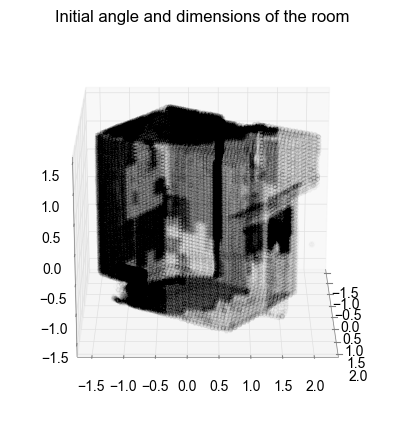
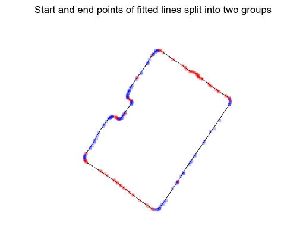
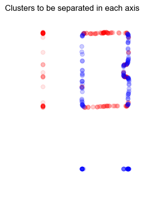
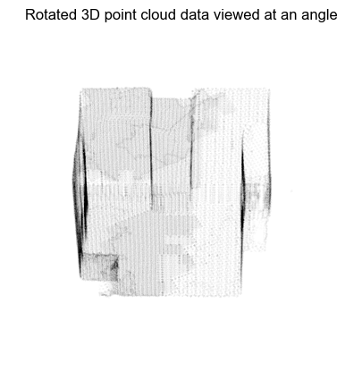
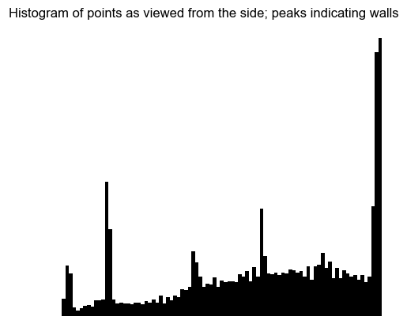
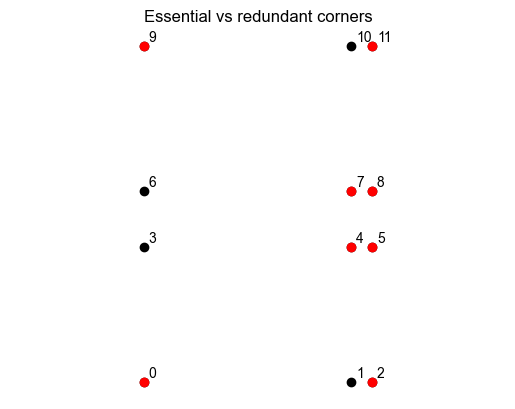
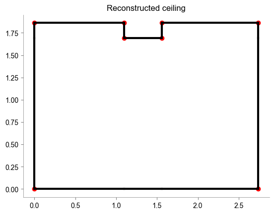

# Corner detection in 3D LiDAR point clouds
### 0. Loading the data
Notice how the data is at an angle.

### 1. Detecting edges
By collapsing the data onto two dimensions and Gaussian blurring, a neat contour can be obtained.

Using the [Hough transform](https://en.wikipedia.org/wiki/Hough_transform) start and end points denoting lines can be identified. Calculating the vector gradients of these, classification into the two perpendicular wall directions is possible.

### 2. Identification of subgroups
The subgroups of the two clusters can be further classified using a simple one dimensional density classifier, which I adapted from [DBSCAN](https://en.wikipedia.org/wiki/DBSCAN). 

Taking averages along their respective dimensions, these subgroups can now be represented with a single parameter in vector lines of the form  $\textbf{x} = \textbf{a} + \lambda \textbf{d}$. 

### 3. Calculating corners
Potential corners can be identified using the linear solutions for the pairwise intersection of any perpendicular lines.

A limitation of this algorithm is the presence of supernumerary corners, due to wall indents. Approaches using the [Douglas-Peucker algorithm](https://en.wikipedia.org/wiki/Ramer%E2%80%93Douglas%E2%80%93Peucker_algorithm) or contour algorithms may filter out the redundant points. However, additional corners may also be of use in room reconstruction.

### 4. Scaling to metres
To convert the point values to metres, we must first rotate the 3d point cloud using [Rodrigues's rotation formula](https://en.wikipedia.org/wiki/Rodrigues%27_rotation_formula), the normal, axis and angle.

Collapsing to one dimensions in x and y, histogram peaks will indicate the presence of walls.

The x and y differences between the relative positions of these peaks give rise to the dimensions of the room:
`array([3.74314508, 7.08169256])`.

Calculating also the relative differences between the points, the ratio between these two units can be used to scale the corners to metres.

Due to the non-determinism of the probabilistic Hough transform, I have observed ~5cm differences between runs.

### 5. Reconstruction
First we build a network comprising all allowable connections between corners (nodes), and the distance between them. From here, we can write an algorithm that visits each node and connects to the nearest unvisited one. When reaching the next node involves a change in direction, a true corner is identified.

Finally, having all the information, we can reconstruct the ceiling profile:

